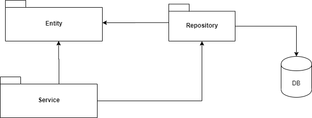
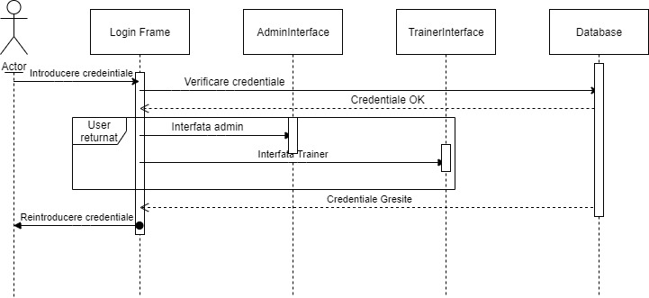

# Aplicatie pentru gestionarea activitatilor intr-o sala de forta

## Descrierea problemei
Intrucat in ziua de azi ne confruntam tot mai mult cu probleme legate de sedentarism sau obezitate, trebuie sa luam in serios miscarea si sportul zilnic. Pentru multi dintre noi cel mai convenient e sa alegem sa mergem la sala pentru a face sport si a ne intretine corpul sanatos. Insa cel mai dificil cand mergem la sala este alegerea exercitiilor, alegerea unui program din multitudinea celor prezente pe internet precum si alegerea unei diete.
Problema de rezolvat o reprezinta implementarea unei aplicatii in vederea gestionarii activitatilor dintr-o sala de forta si monitorizarea acestora, precum si crearea unor programe de exercitii sau de dieta de catre un antrenor.

## Solutia aleasa
 Aplicatia va contine doua tipuri de useri, administrator care poate efectua operatii de tip CRUD, pentru a stoca, sterge si a modifica date din baza de date si antrenor care poate selecta anumite alimente pentru a creea o dieta, precum si exercitii pentru a alcatui un program de antrenament.
 Pentru interfata grafica cu utilizatorul vom folosi Android, iar pentru backend vom folosi librarii preimplementate din Java, precum Hibernate pentru conexiunea cu baza de date, MySQL Workbench pentru gestionarea bazei de date si a tabelelor, iar pentru interactiunea cu interfata grafica se va folosi Spring.
 
## Implementare

### Baza de date

Baza de date este descrisa cu ajutorul ORM-ului Hibernate si este alcatuita din tabela de traineri si de admini precum si tabela de account-uri. Tabelele de admini si traineri sunt unificate prin tabela de user, care are o conexiune de one-to-one cu tabela de account prin campul de username. De asemenea avem si tabela cu exercitii precum si cu alimente exemplificate in schema de mai jos.

.png)

### Structura aplicatie

Aplicatia este structurata pe o arhitectura de tip layer, in care comunicarea intre module se face pe nivele, astfel ca pentru conexiunea cu baza de date avem un set de clase care sunt responsabile, iar pentru a oferi date, vom folosi clase de service care vor comunica informatiile necesare.
Avem urmatoarea diagrama de pachete:
* Entity - clasele care modeleaza obiectele 
* Repository - clasele responsabile pentru operatiile pe baza de date
* Service - clasele responsabile de logica aplicatiei (legatura cu entity e una indirecta)

### Design Patterns

Legatura dintre clasele pachetului Repository si cele ale pachetului Service s-a realizat cu ajutorul design pattern-ului Facade. Acest design pattern ascunde complexitatea sistemului si ofera utilizatorului o interfata prin care sa poata accesa sistemul.

De asemenea, ne dorim ca in sistemul nostru, orice modificare sa fie semnalata. Astfel, daca un trainer decide sa adauge in baza de date un nou exercitiu, administratorul va fi notificat. Aceasta functionalitate a fost implementata utilizand design pattern-ul Observer. 

Existenta mai multor tipuri de alimente: proteice, fibre si calorii, duce la cresterea complexitatii sistemului si a logicii acestuia. Pentru a scapa de aceasta complexitate, am implementat design pattern-ul Factory care pe baza unui tip furnizat, ne genereaza obiectul dorit.

### Diagrama de secventa

Mai jos avem o diagrama de secventa care reprezinta procesul de login al unui user. Liniile punctate verticale reprezinta lifeline-urile actorului si ale componentelor. Dreptungiurile verticale reprezinta perioada de activare a obiectului. Liniile normale reprezinta request-uri, iar cele punctate subliniaza raspunsurile sistemului.

### Todos

 - Mai multe unit teste
 - Modificari necesare proiectarii interfetei de UI
 
 

[//]: # (These are reference links used in the body of this note and get stripped out when the markdown processor does its job. There is no need to format nicely because it shouldn't be seen. Thanks SO - http://stackoverflow.com/questions/4823468/store-comments-in-markdown-syntax)

   [dill]: <https://github.com/joemccann/dillinger>
   [git-repo-url]: <https://github.com/joemccann/dillinger.git>
   [john gruber]: <http://daringfireball.net>
   [df1]: <http://daringfireball.net/projects/markdown/>
   [markdown-it]: <https://github.com/markdown-it/markdown-it>
   [Ace Editor]: <http://ace.ajax.org>
   [node.js]: <http://nodejs.org>
   [Twitter Bootstrap]: <http://twitter.github.com/bootstrap/>
   [jQuery]: <http://jquery.com>
   [@tjholowaychuk]: <http://twitter.com/tjholowaychuk>
   [express]: <http://expressjs.com>
   [AngularJS]: <http://angularjs.org>
   [Gulp]: <http://gulpjs.com>

   [PlDb]: <https://github.com/joemccann/dillinger/tree/master/plugins/dropbox/README.md>
   [PlGh]: <https://github.com/joemccann/dillinger/tree/master/plugins/github/README.md>
   [PlGd]: <https://github.com/joemccann/dillinger/tree/master/plugins/googledrive/README.md>
   [PlOd]: <https://github.com/joemccann/dillinger/tree/master/plugins/onedrive/README.md>
   [PlMe]: <https://github.com/joemccann/dillinger/tree/master/plugins/medium/README.md>
   [PlGa]: <https://github.com/RahulHP/dillinger/blob/master/plugins/googleanalytics/README.md>
