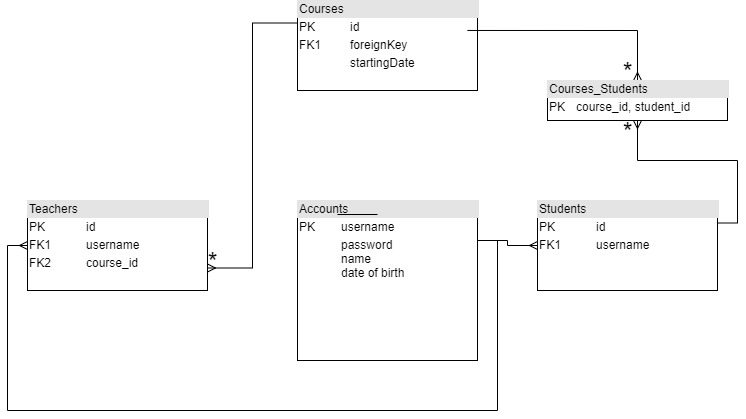

# edu
From students to students

# Problema
In contextul avansului tehnologic masiv din ultimul secol care a persmis o mai buna analizare si intelegere a modului de functionare al oamenilor, au aparut noi modalitati de invatare. Gamificarea, este una din aceste metode de predare-învățare mai si promite a fi mai eficientă si deosebit de valoroasă pentru profesorii care doresc să promoveze învățarea prin jocuri și crearea prin jocuri în sălile de clasă. Jocul în sala de clasă este un instrument eficient pentru învățare și o cale de rezolvare a problemelor abordate printr-o atitudine jucăușă, încurajează elevii și conduce la o învățare mai profundă, ajută la dezvoltarea unor abilități necunoscute de către ei, spiritul și atitudinea acestora sunt descătușate, astfel că jocul facilitează înțelegerea și gândirea divergentă.
##### Avantajele Gamificarii 
 - Face procesul de invatare interactiv și distractiv
 - Îmbunătățește absorbția de cunoștințe și capacitatea de a le reține
 - Creșterea angajamentului elevului
 - Libertatea de a eșua fără consecințe negative și oportunitatea de a încerca din nou

Datorita deschiderii spre tehnologie si in general spre nou al tinerilor si in special al celor din domeniul IT, o prima iteratie a introducerii gamificarii in educatie o poate reprezenta crearea unui soft educational care sa permita studentilor un proces educational ce beneficiaza de toate avantajele prezentate mai sus. Acest soft ar trebui sa poata elimina acele procese greoi si neatractive precum evaluarea studentilor printr-un process ce implica scrierea de cod pe foaie, calculul activitatii semestriale pe baza unor teste punctuale si nu pe urmarirea efortului, timpului si progresului facut de catre student si incurajarea individualitatii si necooperarii de frica copierii temelor.

# Solutia aleasa
Complexitatea problemei este una ridicata, iar procesul educational trebuie rafinat si adaptat de la o generatie la alta. Din acest motiv, solutia aleasa este una care sa permita cadrului didactic o flexibilitate cat mai mare, dar in acelasi timp sa poata realiza automat evaluarea, ghidarea si centralizarea rezultatelor studentilor. 
Aplicatia va permite profesorului sa creeze un curs in care sa poata adauga studentii, sa creeze sarcini pe care studentii trebuie sa le rezolve, dar si sa stabileasca indicatii pentru greselile tipice pe care studentii le pot realiza. De asemenea, acesta va putea lansa competitii sau provocari ce presupun rezolvarea unei probleme mai dificile pentru a stimula studentii, iar un clasament ce contine diferiti parametrii va fi afisat.
Studentul va fi inscris in cadrul mai multor cursuri si va putea sa isi testeze si imbunatateasca solutiile din cadrul sarcinilor lasate de catre profesor, primind indicatii cand greseste. In acest fel, i se ofera oportunitatea sa greseasca fara a avea consecinte negative. Pentru stimulare, se pot oferii si premii sub forma de badge-uri care sa ateste diferite reusite ale acestuia.

# Implementare

## Diagrama bazei de date

